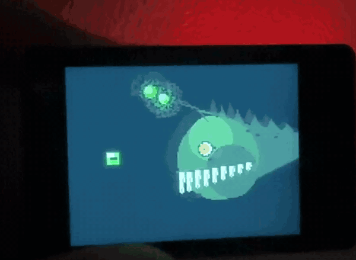

# Scavenger

[English](README.md)

2인치 화면에 사는 츠가이(つがい) — 한 쌍.

화면은 검다. 작은 초록 빛 하나가 숨을 쉬듯 밝아지고 어두워지며 떠다닌다. 물 위의
종이 등처럼. 건드리지 않으면 그게 전부다.

화면을 만지면 愛가 어둠에서 올라온다. 머리에 그 램프를 달고, 뭐든 삼키는 입을 가진
심해 아귀다. 떠 있던 물건을 삼킨다. 덩어리가 몸을 타고 내려간다. 한 번 몸을 떨고
물건을 다시 토해내면 — 작고 창백한 誠가 이미 받을 자리에 와 있다.

`HERE. TAKE IT.`

그리고 아귀는 다시 가라앉는다. 램프가 마지막까지 남아 있다가 꺼지고, 화면은 다시
검어진다.

掃除屋 — 치워주는 쪽.

<p align="center">
  
</p>

<p align="center"><em>실제 보드에서 구동 중 &mdash; <code>git clone</code> 직후의 기본 설정 그대로입니다.</em></p>

## 필요한 것

| | |
|---|---|
| 보드 | Waveshare ESP32-S3-Touch-LCD-2 (2.0" ST7789 IPS, 320×240, CST816 터치) |
| 케이블 | USB-C **데이터** 케이블 — 충전 전용 케이블은 생김새가 같지만 동작하지 않습니다 |
| 호스트 | macOS 또는 Linux, 색상 변환용 Python 3 |

microSD도, 센서도, 네트워크도 쓰지 않습니다. 전부 그려서 만듭니다.

터치 패널이 없거나 동작하지 않는 보드도 괜찮습니다. `TOUCH_ENABLED false`로 두면
몇 초마다 알아서 올라옵니다.

## 실행

```bash
./tools/setup.sh     # arduino-cli, ESP32 코어, 그래픽 라이브러리
./tools/build.sh     # 컴파일 — 보드 없이도 됩니다
./tools/flash.sh     # 보드를 꽂고 업로드
```

`setup.sh`는 몇 번 실행해도 안전합니다(이미 된 건 건너뜁니다). 보드를 못 찾으면
`./tools/doctor.sh`가 요구사항을 한 줄씩 점검해 뭐가 빠졌는지 알려줍니다.

## 바꾸기

사람이 바꿀 만한 값은 전부 **`scavenger/config.h`** 한 파일에 있고, 줄마다 설명이
붙어 있습니다. 다른 파일은 손댈 필요가 없습니다.

| 설정 | 기본값 | 역할 |
|---|---|---|
| `SPIT_LABEL` | `"BFG-9000"` | 스캐빈저가 돌려주는 물건 이름. 마지막 프레임에 표시 (~24자 이내) |
| `FRAME_MS` | `10` | 프레임 간 대기(ms). 작을수록 빠릅니다 |
| `TOUCH_ENABLED` | `true` | 터치로 불러내기. `false`면 알아서 재생 |
| `AUTO_PLAY_MS` | `6000` | 터치가 없을 때, 램프가 얼마나 떠다니다 올라올지(ms) |
| `LAMP_DRIFT_X` / `_Y` | `40` / `22` | 빛이 중앙에서 벗어나는 거리, 캔버스 픽셀 단위(캔버스는 160×120) |
| `LAMP_GLOW` | `9` | 램프 밝기, 1–10 |
| `LAMP_BREATH` | `3` | 그 밝기가 오르내리는 폭 |
| `SCREEN_BRIGHTNESS` | `85` | 백라이트, 0–100 |
| `SCREEN_ROTATION` | `1` | `1` 가로, `3` 180° 뒤집기 |

파일 4번 섹션은 보드 핀 맵입니다. 보드를 바꾼 게 아니라면 그대로 두세요.

## 구조

모든 그림은 160×120 캔버스에 그려서 패널에 2배로 확대해 올립니다. 픽셀이 거친 건
의도된 것입니다 — 안티앨리어싱도, 부드러운 곡선도 없고, 팔레트는 `scavenger.h`
맨 위에 손으로 고른 RGB565 20색이 전부입니다.

| 파일 | 내용 |
|---|---|
| `scavenger/scavenger.ino` | 부팅, 대기 중의 램프, 그리고 연극을 시작하는 한 줄 |
| `scavenger/scavenger.h` | 팔레트, 愛, 誠, 램프, `scavPlay()` |
| `scavenger/config.h` | 바꿀 만한 숫자 전부 |
| `scavenger/lowres.h` | 캔버스, 2배 blit, 프레임 타이밍, 보조 함수 |
| `scavenger/touch.h` | CST816 패널 — 눌렀는지, 어디를 눌렀는지 |

`scavPlay()`는 9개 구간입니다. 빛 혼자 · 어둠에서 아귀가 드러남 · 턱이 벌어짐 ·
사라짐(흰 프레임 한 장) · 덩어리가 내려감 · 誠 등장 · 인계 · 가라앉음 · 돌아온
물건을 마지막으로 한 번. 시작하면 끝까지 화면을 독점하는 블로킹 호출입니다.

생물의 생김새를 바꾸려면 `scavFish()`나 `scavMakoto()`를, 구간을 추가하거나 순서를
바꾸려면 `scavPlay()`를 고칩니다. 새 색을 쓸 때는 hex를 추측하지 말고:

```bash
python3 tools/rgb565.py "#7fae5e"
```

RGB565는 RGB888이 아닙니다. 상수를 잘못 넣으면 에러가 아니라 엉뚱한 색으로
나타납니다.

`config.h` 밖을 고쳤다면:

```bash
./tools/verify.sh    # 동작이 달라지는 모든 설정 조합을 컴파일
```

## 뭔가 이상할 때

| 증상 | 확인 |
|---|---|
| 화면에 아무것도 없음 | `./tools/monitor.sh` 실행 후 RESET — 부팅 로그에 LCD 초기화 결과가 찍힙니다 |
| 업로드 실패 / 포트 없음 | **BOOT** 누른 채 **RESET** 탭, **BOOT** 놓고 `flash.sh` 재실행 |
| 터치해도 반응 없음 | 부팅 로그에 CST816 응답 여부가 나옵니다. 없으면 `TOUCH_ENABLED false` |
| 글자가 잘림 | 160px 캔버스에 6px 폰트 — 약 26자를 넘으면 조용히 잘립니다 |
| 색이 이상함 | 의도한 hex를 `tools/rgb565.py`에 넣어 `scavenger.h` 값과 비교 |

`./tools/doctor.sh` 한 번이면 대부분 잡히고, 출력은 그대로 코딩 에이전트에 붙여
넣도록 만들어 두었습니다.

## 에이전트와 함께 작업할 때

[AGENTS.md](AGENTS.md)가 기준 문서입니다 — 파일 지도, 단 하나의 규칙(config.h
외에는 건드리지 않기), 완료 조건. `CLAUDE.md`와 `GEMINI.md`는 그 문서를 가리킵니다.

## 라이선스

MIT. [LICENSE](LICENSE) 참고.
